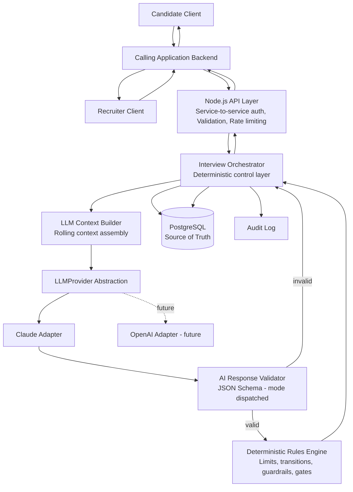
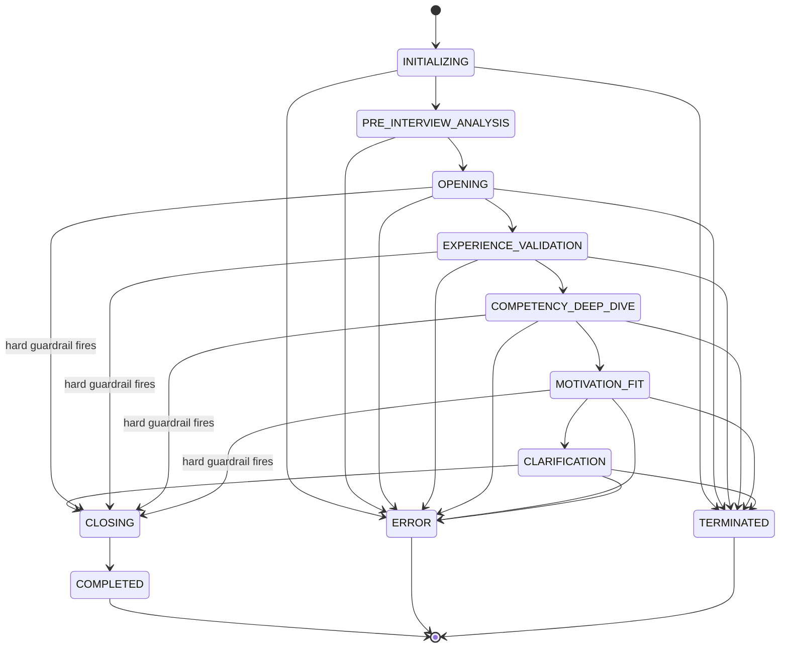

# ARCHITECTURE.md
## Agentic AI HR Interviewer — MVP Technical Specification

Status: Authoritative implementation specification, **v2**. Supersedes v1. This revision closes
implementation blockers C1–C16 identified by Claude Code Plan Mode. Where this document
described a schema shape, enum, or mechanic now superseded by `API_CONTRACT.md` v2,
`INTERVIEW_STATE.md` v2, or `SCORING_FRAMEWORK.md` v2, **those documents are authoritative** for
the exact shape — this document retains the narrative architecture description and is amended
in-place only where v1's prose actively contradicted the resolved decisions below.

**v2 changelog summary (full detail in the CONTRACT CHANGELOG delivered alongside this
document):** two AI call shapes instead of one blended `AIDecision` (C1/C2); critical gates
decoupled from `MUST_HAVE` priority (C4); parallel competency/requirement scoring, no blended
average (C5); Nice-to-Have auto-promotion removed (C6); competency rating derived by threshold,
not model-supplied (C7); requirement notes fully deterministic (C8); forced completion
generalized to any active phase (C9); idempotency backed by an explicit operation-state machine
(C10/C12/C13); evidence gaps are a structured entity (C11); service-to-service auth model, no
candidate bearer tokens (C14); phase limits downgraded to soft budgets (C15); competency
coverage level added (C16).

Target implementer: Claude Code, following this document (and its companions) exactly unless
explicitly instructed otherwise.

---

## 1. Executive Architecture Summary (unchanged)

The system conducts adaptive, evidence-based candidate interviews using a single **HR
Interviewer Agent** (an LLM-backed Interview Intelligence Engine) wrapped by a deterministic
**Node.js/TypeScript orchestration layer**.

Node.js is the authority for everything that must be reliable, repeatable, and auditable:
identity, state transitions, limits, persistence, validation, security, and — as of this
revision — gate configuration and final scoring in their entirety. The LLM is the authority for
everything that requires judgment: what to ask next, whether evidence is sufficient, and how to
phrase the interview.

The LLM never writes to the database, never enforces limits, never controls interview lifecycle,
and — clarified in this revision — **never determines what counts as a critical hiring gate or
what the final numeric score is.** It only recommends. Node.js validates every recommendation
against a JSON Schema and a deterministic rules engine before anything is persisted or shown to
the candidate.

Single-agent design remains intentional for the MVP. The agent now operates in two explicit,
separately-schema'd call modes (initialization and turn — see Section 9a) rather than one
blended output shape, but this is still **one agent, one prompt, two response schemas** — not a
second agent (C1).

---

## 2. Recommended MVP Architecture (unchanged)

**Pattern: 1 HR Interviewer Agent + Deterministic Node.js Orchestrator, stateless LLM calls,
relational database as single source of truth.**

---

## 3. Mermaid Architecture Diagram (unchanged)



**Change (C14):** the diagram now shows the calling application backend as the sole caller of
this service — no direct Candidate/Recruiter → API edge. See Section 23 for the amended trust
boundary.

---

## 4. Responsibility Matrix: Node.js vs AI (amended row: gates)

| Concern | Node.js (deterministic) | HR Interviewer Agent (adaptive) |
|---|---|---|
| API surface, auth, authz | ✅ Owns (service-to-service, see §23) | — |
| Interview ID, session validity | ✅ Owns | — |
| Interview lifecycle / state machine | ✅ Owns final transition | Recommends transition |
| Question ID, sequencing, persistence | ✅ Owns | Proposes question content |
| Max duration / max questions / max follow-ups | ✅ Owns and enforces (hard) | Must respect if informed |
| **Phase time/question allocation (NEW, C15)** | ✅ Owns as a *soft budget signal only* — never forces a transition | Uses `phaseBudgetStatus` to prioritize, never assumes it can be ignored or that it forces anything |
| Idempotency, duplicate/retry handling | ✅ Owns (explicit operation state machine, C10/12/13) | — |
| Request & response schema validation | ✅ Owns (two schemas: `InitializationDecision`, `TurnDecision`) | Must conform to whichever schema `mode` selects |
| Evidence & assessment **persistence** | ✅ Owns | Proposes evidence/assessment updates |
| Evidence & assessment **judgment** | Accepts/rejects proposal | ✅ Produces judgment (strength/coverage/confidence band only — never a numeric score) |
| **Critical gate designation (NEW, C4)** | ✅ Owns exclusively — recruiter/job configuration only | ❌ No authority, no input field, never inferred |
| **Numeric scoring (1–5) (clarified, C5/C7)** | ✅ Owns exclusively, at finalization only, via deterministic rubric | ❌ Never produces a score, in either call mode |
| Job requirement / CV analysis | — | ✅ Owns |
| Interview strategy / objective selection | Bounded by rules engine | ✅ Owns within bounds |
| Next question generation | — | ✅ Owns |
| Probing depth decision (follow-up vs move on) | Caps enforced by Node.js | ✅ Recommends |
| Final recommendation to complete interview | Node.js decides to *act* on it | ✅ Recommends |
| Audit logging | ✅ Owns | Supplies `operational_reasoning` metadata |
| Recruiter override | ✅ Owns | — |

**Governing rule, unchanged:** *Node.js decides what the system is allowed to do. The AI decides
what is intelligent to do within those boundaries.*

---

## 5. End-to-End Runtime Flow (unchanged sequence, mode dispatch noted)

The sequence diagram from v1 is unchanged in shape. The one addition: every LLM call now carries
an explicit `mode: "initialization" | "turn"` field in `LLMRequest` (`API_CONTRACT.md` §3.1),
and the `VAL` (Schema Validator) step dispatches to `InitializationDecision` or `TurnDecision`
validation accordingly, rather than validating a single blended `AIDecision` shape.

---

## 6. Interview State Machine (amended — see `INTERVIEW_STATE.md` v2 §2 for the full authoritative table)

### States (unchanged)
`INITIALIZING → PRE_INTERVIEW_ANALYSIS → OPENING → EXPERIENCE_VALIDATION →
COMPETENCY_DEEP_DIVE → MOTIVATION_FIT → CLARIFICATION → CLOSING → COMPLETED`

Exception states: `TERMINATED`, `ERROR`.

### AI-recommended actions (unchanged)
`FOLLOW_UP | CLARIFY | DEEP_DIVE | MOVE_NEXT | COMPLETE_INTERVIEW`

### Transition authority — two v1 statements are amended:

1. **Forced completion (C9):** v1 stated forced completion only fires from `CLARIFICATION →
   CLOSING`. **This is superseded.** A hard global guardrail (max questions, max time, manual
   termination) can force a direct transition to `CLOSING` from **any** active phase, not just
   `CLARIFICATION`. See `INTERVIEW_STATE.md` v2 §2.2 for the authoritative table.
2. **Phase caps (C15):** v1 stated "Node.js phase-timeout/question-cap reached" as a *forcing*
   trigger for `OPENING → EXPERIENCE_VALIDATION` and subsequent intra-sequence transitions.
   **This is superseded.** Per-phase allocation is now a soft budget (`phaseBudgetStatus`)
   used only to inform the AI's own prioritization — it never forces a transition on its own.
   Only the AI's own `MOVE_NEXT`/`COMPLETE_INTERVIEW` recommendation, or a *hard global*
   guardrail (not a phase-local one), can move the state machine forward. See
   `INTERVIEW_STATE.md` v2 §4a.

All other transition-authority rows from v1 (Section 6's table) are unchanged and remain
authoritative as originally written.

---

## 7. Mermaid State Diagram (amended)



---

## 8. Core Domain Model (amended — one new entity, one field addition)

Persistent entities, unchanged from v1 except:

- `JobRequirement` gains `criticalGate: boolean` (default `false`, recruiter/config-owned only —
  C4). See `API_CONTRACT.md` §2.4.
- **New entity: `EvidenceGap`** (C11) — structured evidence gaps, replacing the v1 assumption
  that `unresolvedGapIds` referenced free-text descriptions. See `API_CONTRACT.md` §2.10 and
  `INTERVIEW_STATE.md` v2 §7 for the full lifecycle.
- **New entity (implicit, formalized): `TurnOperation`** (C10/C12/C13) — the idempotency/retry
  operation record. Replaces the v1 assumption that idempotency was handled by an unspecified
  cache-lookup. See `API_CONTRACT.md` §5.
- `FinalAssessment` gains `competencyScore` (replacing a single blended `overallScore`),
  `niceToHaveHighlights`, and `scoringConfigVersion`. See `API_CONTRACT.md` §2.9 and
  `SCORING_FRAMEWORK.md` §9.

All other entities (`Interview`, `InterviewState`, `InterviewPlan`, `Candidate`, `Position`,
`Question`, `CandidateResponse`, `Evidence`, `RequirementAssessment`, `CompetencyAssessment`,
`AuditEvent`) are unchanged in kind; their exact field-level shapes are as amended in
`API_CONTRACT.md` v2.

LLM context objects are now explicitly two pairs, not one: `InitializationRequest` /
`InitializationDecision`, and `TurnRequest` / `TurnDecision` (C1). `AIDecision` as a single
blended name is retired — see `API_CONTRACT.md` §4 for both exact shapes.

---

## 9. TypeScript Interfaces

**This section is superseded in full by `API_CONTRACT.md` v2, Sections 2–4.** Rather than
duplicate ~200 lines of interface definitions in two places (which is exactly how v1's
inconsistencies between this document and `SCORING_FRAMEWORK.md`/`INTERVIEW_FRAMEWORK.md` arose
in the first place), this document now defers entirely to `API_CONTRACT.md` for exact shapes.
The narrative descriptions elsewhere in this document (Sections 10–29) remain accurate at the
architectural level; wherever a narrative description implies a field shape, `API_CONTRACT.md`
v2 governs the literal type.

## 9a. Two Call Modes (C1 — new subsection)

The HR Interviewer Agent is invoked in exactly two modes, both by the same `LLMProvider`
interface, both governed by the same versioned system prompt (`HR_INTERVIEWER_SYSTEM_PROMPT.md`
v1.1), and both independently schema-validated:

| Mode | When | Request shape | Response shape |
|---|---|---|---|
| `initialization` | Once, at interview creation | `InitializationRequest` | `InitializationDecision` |
| `turn` | Once per candidate answer | `TurnRequest` | `TurnDecision` |

This is not a two-agent architecture — it is one agent with a `mode` dispatch field, matching
the original "two conceptual moments, same prompt family" design intent, now made
schema-explicit rather than blended into one shape that had to awkwardly represent both an
objectives list and a next-question recommendation in the same optional fields.

---

## 10. Database Design (amended: two new tables)

Unchanged core recommendation: single PostgreSQL database. Tables from v1 remain, plus:

```
job_requirements        (..., critical_gate BOOLEAN DEFAULT FALSE)   -- amended (C4)
evidence_gaps            (id PK, interview_id FK, objective_id FK, gap_type, description,
                           status, created_at, resolved_at)            -- NEW (C11)
turn_operations          (id PK, scope, idempotency_key, request_hash, interview_id NULL,
                           question_id NULL, status, attempt_count, response_status,
                           response_body JSONB NULL, created_at, updated_at, expires_at)
                           -- NEW (C10/C12/C13), unique on (scope, interview_id, question_id, idempotency_key)
                           -- and (scope, idempotency_key) for interview_create
position_competency_weights (position_id FK, competency_tag, weight)  -- NEW (C5), optional; absence
                           -- of a row for a given tag means the MVP default weight (1.0) applies
```

The v1-described `interview_access_tokens` subsystem is explicitly **not built** (C14 — see
§23).

A separate `turn_results` table, considered during the C10/C12/C13 review, was rejected as
unnecessary: `turn_operations.response_body` carries the successful payload directly, so a
single table represents both the retry-state machine and the cached successful result.

### Transaction boundaries (unchanged principle, one addition)

Every write to `turn_operations` that reflects a terminal outcome (`SUCCEEDED`,
`FAILED_RETRYABLE`, `FAILED_FINAL`) commits in the **same** transaction as the state change it
describes (or the same short transaction as the candidate-answer write, for the pre-LLM-call
step) — the operation record must never be able to say `SUCCEEDED` while the underlying
`InterviewState`/`Evidence` writes did not actually commit, or vice versa.

---

## 11. REST API Contract

**Superseded by `API_CONTRACT.md` v2 Section 6** for exact request/response shapes and error
codes. Endpoint list is unchanged from v1 (`POST /interviews`, `POST /interviews/{id}/responses`,
`GET /interviews/{id}`, `GET /interviews/{id}/result`, `GET /interviews/{id}/transcript`,
`POST /interviews/{id}/terminate`) — no new endpoints beyond the already-resolved transcript
endpoint from the prior revision.

---

## 12–13. Create Interview Flow / Submit Response Flow (amended: operation-tracked)

Both flows from v1 are unchanged in their step sequence, with the idempotency step (step 3 of
Submit Response, and the `Idempotency-Key` handling of Create Interview) now referring to the
explicit `TurnOperation` state machine (`API_CONTRACT.md` §5) rather than an implicit cache. The
Create Interview flow additionally performs the **ref → UUID minting step** (C2, `API_CONTRACT.md`
§2.3) between "Validate AI Response" and "Persist InterviewState": Node.js validates the
`InitializationDecision.objectives[].ref` values are unique, mints canonical UUIDs, rewrites
`first_question.objective_ref` to the canonical UUID, and only then persists.

---

## 14. InterviewState Design (amended field, unchanged principle)

`InterviewState` gains `phaseElapsedSeconds: Record<InterviewPhase, number>` (C15) to support
soft-budget computation. It remains intentionally small — still the only piece of interview
progress state read/written on every turn.

---

## 15. AI Request Contract (amended: gate data excluded)

Design principles unchanged, with one explicit addition (C4): `CompactRequirement` sent to the
AI **never includes `criticalGate`**. The AI reasons about `priority` (MUST_HAVE/NICE_TO_HAVE)
only, and has no way to know — and must not be able to infer — which requirements are
configured as hard gates. This is a deliberate information boundary, not an oversight: gate
enforcement must remain entirely a Node.js/recruiter-configuration concern, immune to any
prompt-level influence.

---

## 16. AI Response Contract

**Superseded by `API_CONTRACT.md` v2 Section 4** (`InitializationDecision`, `TurnDecision`).
Design notes from v1 that remain true: `operational_reasoning` stays a fixed two-field
structure, stored in `audit_events`, never candidate-facing; `INSUFFICIENT` strength +
`NOT_COVERED` coverage is how "low competency" is distinguished from "insufficient evidence,"
enforced deterministically by Node.js regardless of what the model outputs; all enums are closed
sets validated against `API_CONTRACT.md`'s TypeScript unions.

---

## 17. LLM Provider Abstraction (amended: mode-aware, two schemas)

```typescript
interface LLMProvider {
  generateStructuredResponse<T>(
    request: LLMRequest,      // now carries `mode` (API_CONTRACT.md §3.1)
    schema: Schema<T>          // Schema<InitializationDecision> or Schema<TurnDecision>, per mode
  ): Promise<T>;
}
```

All other provider-abstraction principles (structured output as optimization not trust
boundary, adapter-level transport retries, orchestrator-level schema-validation retries, config-
externalized model/temperature/tokens) are unchanged from v1.

---

## 18. Context Optimization Strategy (amended: structured gaps)

Unchanged table from v1, with `EvidenceRef[]`/gap content now typed as structured
`EvidenceGapRef[]` (C11) rather than an implicit free-text gap description. See
`INTERVIEW_STATE.md` v2 §5 for the authoritative version of this table.

---

## 19–22. Transaction / Idempotency / Retry / Error Handling Strategy

**Superseded in mechanism by `API_CONTRACT.md` v2 §5 and `INTERVIEW_STATE.md` v2 §6** (the
`TurnOperation` state machine). The governing principles from v1 remain true and are now
mechanically explicit rather than descriptive:
- Any transaction that would hold open across an LLM network call is split in two.
- The candidate's answer is always durable before the LLM is called.
- A retryable failure never permanently caches as if it succeeded, and never behaves as if the
  original request never existed — it resumes a tracked operation.
- No unbounded retry loops; every retry path has a fixed cap and a defined terminal fallback.

---

## 23. Security Architecture (amended — C14, service-to-service trust boundary)

**This section is substantially amended.** v1 implied direct candidate/recruiter authentication
via role-separated tokens (`candidate` vs. `recruiter/admin`) at this service's own API layer.
**This is superseded.**

- **Deployment topology:** `Candidate → Client/Application → Application Backend → HR
  Interviewer Service`. This service is never directly exposed to a candidate's browser/app.
- **Authentication principal:** the calling application backend, authenticated via a minimal
  service-to-service credential (API key, service JWT, or mTLS — implementer's infrastructure
  choice). This service does not authenticate individual candidates or recruiters.
- **`candidateId` / `interviewId` are business identifiers, not authentication principals** —
  they identify which interview a request concerns; they grant no access on their own. The
  calling application backend is trusted to have already verified the human on its own session
  is entitled to act on that identifier.
- **No candidate bearer tokens. No `interview_access_tokens` subsystem.** These are explicitly
  rejected for MVP (C14) unless a future, separately-scoped requirement introduces a direct
  candidate-to-service client with no application-backend intermediary.
- **Recruiter/admin authorization** for `GET /result`, `POST /terminate`, and
  `GET /transcript` may remain entirely at the application layer, or be asserted via a role
  claim in the service credential if this service is ever called by multiple distinct backends
  needing different permission levels — either approach is acceptable for MVP; the calling
  backend, not this service, is responsible for verifying the human recruiter's identity.

Everything else in v1's Section 23 (PII protection, encryption at rest/in transit, data
retention, secrets management, audit logging) is unchanged and remains authoritative.

---

## 24. Prompt Injection Protection (amended: gate/scoring boundary explicit)

Unchanged mechanisms from v1 (system/user separation, structured boundaries, explicit framing
instruction, schema as enforcement, input sanitation, no tool access), plus one addition made
explicit by C4/C5: **even a fully successful prompt injection cannot produce a critical-gate
judgment or a numeric score**, because the AI's output schemas (`InitializationDecision`,
`TurnDecision`) contain no field capable of expressing either — this is a schema-level
guarantee, not merely a prompt instruction that could theoretically be talked around.

---

## 25–27. Auditability / Human Override / Horizontal Scaling

Unchanged from v1, with two additions:
- Every forced `{phase} → CLOSING` transition (C9, generalized beyond `CLARIFICATION`) writes
  an `AuditEvent(type=STATE_TRANSITION, actor=SYSTEM_FORCED)` naming the guardrail.
- Every `TurnOperation` state change is itself part of the auditable trail (C10/C12/C13) —
  `attemptCount` and `status` history make retry behavior directly inspectable, not just
  inferable from `AuditEvent` rows.

---

## 28. MVP vs Future Architecture (unchanged)

Single-agent, two-call-mode MVP remains preferred. The multi-agent evolution path (Planner /
Interviewer / Evidence Evaluator / Final Assessment agents) remains deferred, unaffected by this
revision — none of C1–C16 required moving scoring or gate logic into a second LLM agent; all of
it moved into deterministic Node.js instead, which is the opposite direction from added agent
complexity and consistent with the governing principle of avoiding premature complexity.

---

## 29. Key Architecture Risks (amended: two new rows)

| Risk | Mitigation |
|---|---|
| (all v1 rows unchanged) | |
| **Blended competency/requirement scoring double-counts shared evidence (NEW)** | Parallel, independently-computed Competency Score and Requirement Fit tracks; gate status only caps, never adds (`SCORING_FRAMEWORK.md` §5–6) |
| **Phase soft budgets ignored by the AI degrade pacing (NEW)** | `phaseBudgetStatus` is advisory, but hard global guardrails (questions/time) remain a backstop regardless of phase-level pacing quality — an ignored soft signal degrades interview *quality*, never *safety/completion guarantees* |

---

## 30. Recommended Technical Decisions (Decision Log) — amended entries

| Decision point | Recommendation | Rationale |
|---|---|---|
| (all v1 rows unchanged except:) | | |
| AI call shape | Two schemas (`InitializationDecision`, `TurnDecision`) under one `mode`-dispatched agent | Cleaner validation, removes v1's awkward "optional fields depending on which moment this is" blending (C1) |
| Critical gate ownership | Node.js/recruiter-config only; independent boolean field, never derived from `MUST_HAVE` | Prevents priority-label conflation with hard hiring gates (C4) |
| Scoring architecture | Parallel Competency Score + Requirement Fit, never blended | Avoids double-counting shared evidence; clearer recruiter-facing reporting (C5) |
| Phase time/question allocation | Soft budget signal, not a hard cap | Matches `INTERVIEW_FRAMEWORK.md`'s own framing of phase durations as targets; avoids truncating a genuinely valuable line of questioning (C15) |
| Authentication model | Service-to-service; no candidate tokens | Matches actual deployment topology (application backend as intermediary); avoids a token subsystem with no concrete requirement (C14) |
| Idempotency/retry | Explicit `TurnOperation` state machine, single table | Makes retry semantics auditable and testable rather than an implicit cache; avoids a redundant second results table (C10/C12/C13) |
| Evidence gap representation | Structured entity keyed on (objective, gapType) | Avoids fragile free-text deduplication while staying simple (C11) |

---

*End of ARCHITECTURE.md v2. See `API_CONTRACT.md` v2, `INTERVIEW_STATE.md` v2, and
`SCORING_FRAMEWORK.md` v2 for exact shapes, state mechanics, and scoring configuration
respectively. `HR_INTERVIEWER_SYSTEM_PROMPT.md` v1.1 is the synchronized production prompt.*
