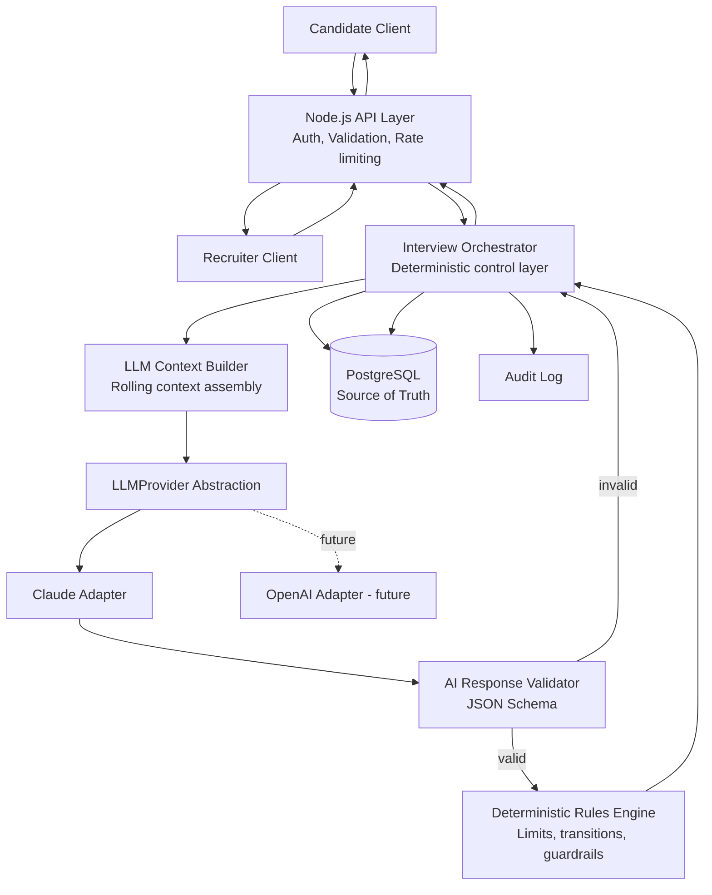
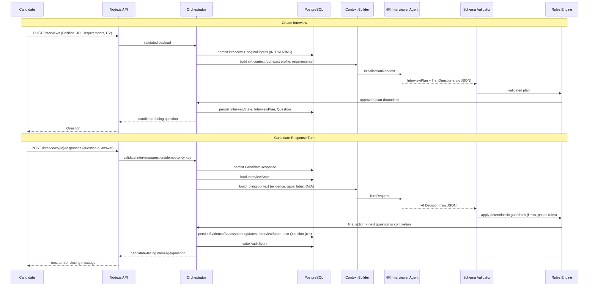
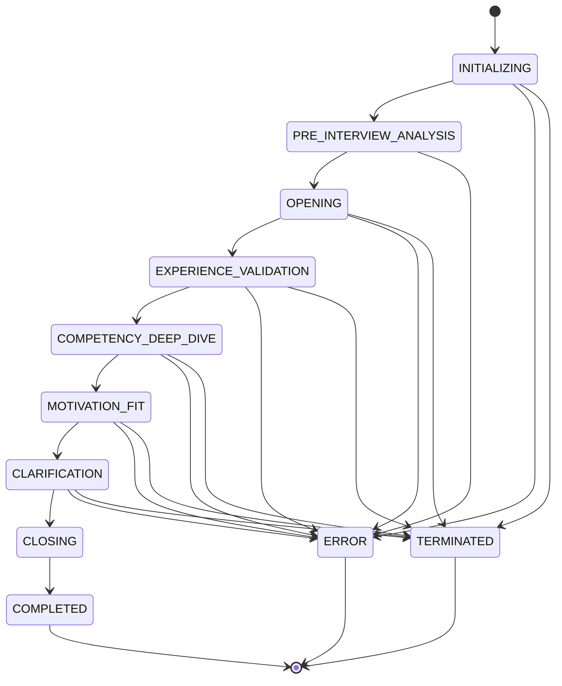
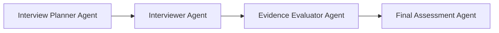

# ARCHITECTURE.md
## Agentic AI HR Interviewer — MVP Technical Specification

Status: Authoritative implementation specification
Scope: Architecture and contracts only. No application code generated.
Target implementer: Claude Code, following this document exactly unless explicitly instructed otherwise.

---

## 1. Executive Architecture Summary

The system conducts adaptive, evidence-based candidate interviews using a single **HR Interviewer Agent** (an LLM-backed Interview Intelligence Engine) wrapped by a deterministic **Node.js/TypeScript orchestration layer**.

Node.js is the authority for everything that must be reliable, repeatable, and auditable: identity, state transitions, limits, persistence, validation, and security. The LLM is the authority for everything that requires judgment: what to ask next, whether evidence is sufficient, and how to phrase the interview.

The LLM never writes to the database, never enforces limits, and never controls interview lifecycle directly — it only **recommends**. Node.js validates every recommendation against a JSON Schema and a deterministic rules engine before anything is persisted or shown to the candidate. This keeps the system safe, provider-agnostic, and cheap to reason about, while still being adaptive.

Single-agent design is intentional for the MVP: it minimizes orchestration complexity, latency, and cost while still meeting all functional requirements. A multi-agent evolution path is defined (Section 28) but is explicitly out of scope until measurable quality gaps justify it.

---

## 2. Recommended MVP Architecture

**Pattern: 1 HR Interviewer Agent + Deterministic Node.js Orchestrator, stateless LLM calls, relational database as single source of truth.**

Key decisions (see Section 30 for the full decision log):

- **One LLM role**, invoked at two conceptual moments: interview initialization (produce an `InterviewPlan` + first question) and each candidate response turn (evaluate answer, produce next action + question). Same prompt family, same schema family — not two agents, one agent with two operation modes.
- **Stateless LLM**: no conversation memory, no server-side "assistant" threads. Every call is a fresh, fully self-contained request built by Node.js from persisted state.
- **Single relational database** (PostgreSQL) as the sole source of truth. No cache layer, no vector DB, no message queue in the MVP — none of the stated requirements need them.
- **Schema-validated JSON** for every AI output, enforced with a JSON Schema validator (e.g., Ajv) server-side, independent of the model provider's own structured-output feature (which is treated as a hint/optimization, not a trust boundary).
- **Provider abstraction** via a single `LLMProvider` interface; the orchestrator and business logic never import a provider SDK directly.

---

## 3. Mermaid Architecture Diagram



---

## 4. Responsibility Matrix: Node.js vs AI

| Concern | Node.js (deterministic) | HR Interviewer Agent (adaptive) |
|---|---|---|
| API surface, auth, authz | ✅ Owns | — |
| Interview ID, session validity | ✅ Owns | — |
| Interview lifecycle / state machine | ✅ Owns final transition | Recommends transition |
| Question ID, sequencing, persistence | ✅ Owns | Proposes question content |
| Max duration / max questions / max follow-ups | ✅ Owns and enforces | Must respect if informed, but Node.js enforces regardless |
| Idempotency, duplicate/retry handling | ✅ Owns | — |
| Request & response schema validation | ✅ Owns | Must conform |
| Evidence & assessment **persistence** | ✅ Owns | Proposes evidence/assessment updates |
| Evidence & assessment **judgment** | Accepts/rejects proposal | ✅ Produces judgment |
| Job requirement / CV analysis | — | ✅ Owns |
| Interview strategy / objective selection | Bounded by rules engine | ✅ Owns within bounds |
| Next question generation | — | ✅ Owns |
| Probing depth decision (follow-up vs move on) | Caps enforced by Node.js | ✅ Recommends |
| Final recommendation to complete interview | Node.js decides to *act* on it | ✅ Recommends |
| Audit logging | ✅ Owns | Supplies `operational_reasoning` metadata |
| Recruiter override | ✅ Owns | — |

**Governing rule:** *Node.js decides what the system is allowed to do. The AI decides what is intelligent to do within those boundaries.* Any AI recommendation that violates a deterministic rule is silently downgraded/rejected by Node.js (see Section 16), never trusted blindly.


---

## 5. End-to-End Runtime Flow



---

## 6. Interview State Machine

### States
`INITIALIZING → PRE_INTERVIEW_ANALYSIS → OPENING → EXPERIENCE_VALIDATION → COMPETENCY_DEEP_DIVE → MOTIVATION_FIT → CLARIFICATION → CLOSING → COMPLETED`

Exception states, reachable from any non-terminal state: `TERMINATED`, `ERROR`.

### AI-recommended actions
`FOLLOW_UP | CLARIFY | DEEP_DIVE | MOVE_NEXT | COMPLETE_INTERVIEW`

### Transition authority

| Transition | Trigger | Authority |
|---|---|---|
| `INITIALIZING → PRE_INTERVIEW_ANALYSIS` | Interview created, inputs persisted | Node.js (deterministic, always happens) |
| `PRE_INTERVIEW_ANALYSIS → OPENING` | AI returns valid `InterviewPlan` | Node.js applies AI recommendation after schema+rules validation |
| `OPENING → EXPERIENCE_VALIDATION` | AI recommends `MOVE_NEXT`, or Node.js phase-timeout/question-cap reached | AI recommends; Node.js decides (can force phase advance even if AI doesn't recommend it) |
| `EXPERIENCE_VALIDATION → COMPETENCY_DEEP_DIVE` | Same as above | AI recommends; Node.js decides |
| `COMPETENCY_DEEP_DIVE → MOTIVATION_FIT` | Same as above | AI recommends; Node.js decides |
| `MOTIVATION_FIT → CLARIFICATION` | AI recommends `CLARIFY`/`MOVE_NEXT`, or unresolved-gap count > 0 at cap | AI recommends; Node.js decides |
| `CLARIFICATION → CLOSING` | AI recommends `COMPLETE_INTERVIEW`, or Node.js hard limits reached (time/question/follow-up caps) | Node.js has final authority; can force this transition regardless of AI |
| `CLOSING → COMPLETED` | Node.js finalizes assessment aggregation | Node.js (deterministic, always happens) |
| `ANY → TERMINATED` | Recruiter action, or candidate abandons past timeout | Node.js only — AI has no authority to terminate |
| `ANY → ERROR` | Unrecoverable validation/provider failure after retries | Node.js only |

Within a phase, `FOLLOW_UP`, `CLARIFY`, and `DEEP_DIVE` are **intra-phase actions**: they generate the next question but do not change `InterviewState.currentPhase`. Only `MOVE_NEXT` and `COMPLETE_INTERVIEW` are candidates for a phase transition, and even then Node.js's rules engine has final say (Section 16 defines override conditions, e.g., max follow-ups per objective already reached forces `MOVE_NEXT` regardless of AI output).

---

## 7. Mermaid State Diagram



---

## 8. Core Domain Model

Persistent entities (database-backed, authoritative):

- `Interview` — root aggregate: identity, status, timestamps, references to Candidate/Position.
- `InterviewState` — current phase, active objective, evidence gaps, counters (questions asked, follow-ups per objective, elapsed time). Mutated only by Node.js, on the write path of a response turn.
- `InterviewPlan` — output of pre-interview analysis: ordered objectives, per-requirement evidence targets. Written once, read-only afterward (recruiter override excepted).
- `Candidate`, `Position`, `JobRequirement` — reference/input data, immutable once the interview starts (edits create a new version, they never mutate historical interviews).
- `Question` — persisted record of every question actually asked, with phase/objective/type metadata and a stable `questionId`.
- `CandidateResponse` — persisted verbatim candidate answer, linked 1:1 to a `Question`.
- `Evidence` — atomic unit of proof extracted from a response, linked to a `JobRequirement`/competency and to the `CandidateResponse` it came from.
- `RequirementAssessment` — rollup per `JobRequirement`: coverage level, evidence list, confidence.
- `CompetencyAssessment` — rollup per competency dimension (may span multiple requirements).
- `FinalAssessment` — end-of-interview aggregate, human-reviewable, override-capable.
- `AuditEvent` — append-only log of every state transition, AI call, validation outcome, and human override.

LLM context objects (transient, never persisted as-is, constructed fresh per call):

- `InitializationRequest` / `TurnRequest` — outbound compact context.
- `AIDecision` — raw structured output from the LLM before validation.
- `ValidatedAIDecision` — same shape, post-schema-and-rules validation, safe to apply.

The distinguishing rule: if it must survive a server restart, a retry, or be shown in an audit trail, it is a **persistent entity**. If it exists only to be serialized into/out of a single LLM call, it is a **context object** and is rebuilt every time from persistent entities — never stored as the model's private state.

---

## 9. TypeScript Interfaces

```typescript
// ===== Enums =====

type InterviewStatus =
  | "INITIALIZING"
  | "PRE_INTERVIEW_ANALYSIS"
  | "OPENING"
  | "EXPERIENCE_VALIDATION"
  | "COMPETENCY_DEEP_DIVE"
  | "MOTIVATION_FIT"
  | "CLARIFICATION"
  | "CLOSING"
  | "COMPLETED"
  | "TERMINATED"
  | "ERROR";

type RecommendedAction =
  | "FOLLOW_UP"
  | "CLARIFY"
  | "DEEP_DIVE"
  | "MOVE_NEXT"
  | "COMPLETE_INTERVIEW";

type RequirementPriority = "MUST_HAVE" | "NICE_TO_HAVE";

type EvidenceStrength = "STRONG" | "MODERATE" | "WEAK" | "INSUFFICIENT";

// ===== Persistent Entities =====

interface Candidate {
  id: string;
  fullName: string;
  cvRawText: string;          // stored encrypted at rest; treated as untrusted data
  cvStructuredSummary: CandidateProfileSummary; // derived once, cached
  createdAt: string;
}

interface Position {
  id: string;
  title: string;
  jobDescription: string;     // untrusted data
  companyContext?: string;
  organizationalValues?: string;
  createdAt: string;
}

interface JobRequirement {
  id: string;
  positionId: string;
  label: string;
  description: string;        // untrusted data
  priority: RequirementPriority;
  competencyTag: string;
  recruiterWeight?: number;   // human override, default 1.0
}

interface Interview {
  id: string;
  candidateId: string;
  positionId: string;
  status: InterviewStatus;
  createdAt: string;
  updatedAt: string;
  startedAt?: string;
  completedAt?: string;
  terminatedReason?: string;
  maxDurationMinutes: number;
  maxQuestions: number;
  maxFollowUpsPerObjective: number;
}

interface InterviewPlan {
  interviewId: string;
  objectives: InterviewObjective[];
  createdAt: string;
  version: number; // incremented on recruiter override
}

interface InterviewObjective {
  id: string;
  phase: Exclude<InterviewStatus, "INITIALIZING" | "PRE_INTERVIEW_ANALYSIS" | "COMPLETED" | "TERMINATED" | "ERROR">;
  requirementIds: string[];
  competencyTag: string;
  targetEvidenceCount: number;
  status: "PENDING" | "IN_PROGRESS" | "SATISFIED" | "INSUFFICIENT_EVIDENCE";
}

interface InterviewState {
  interviewId: string;
  currentPhase: InterviewStatus;
  currentObjectiveId: string | null;
  questionsAskedCount: number;
  followUpsByObjective: Record<string, number>;
  unresolvedGapIds: string[];
  lastQuestionId: string | null;
  version: number; // optimistic concurrency
  updatedAt: string;
}

interface Question {
  id: string;
  interviewId: string;
  sequenceNumber: number;
  phase: InterviewStatus;
  objectiveId: string | null;
  competencyTag: string | null;
  questionType: string; // e.g. "behavioral_follow_up", "opening", "clarification"
  text: string;
  askedAt: string;
}

interface CandidateResponse {
  id: string;
  questionId: string;
  interviewId: string;
  rawText: string;             // untrusted data
  submittedAt: string;
  idempotencyKey: string;
}

interface Evidence {
  id: string;
  interviewId: string;
  requirementId: string | null;
  competencyTag: string;
  sourceResponseId: string;
  summary: string;             // AI-produced, evidence-based summary, not verbatim CV/answer copy required
  strength: EvidenceStrength;
  createdAt: string;
}

interface RequirementAssessment {
  requirementId: string;
  interviewId: string;
  coverageLevel: "COVERED" | "PARTIALLY_COVERED" | "NOT_COVERED";
  confidence: number; // 0-1
  evidenceIds: string[];
  insufficientEvidenceFlag: boolean; // distinguishes "low competency" from "no data"
  notes: string;
}

interface CompetencyAssessment {
  competencyTag: string;
  interviewId: string;
  rating: "STRONG" | "ADEQUATE" | "WEAK" | "INSUFFICIENT_EVIDENCE";
  evidenceIds: string[];
  rationale: string; // concise, evidence-referencing, not chain-of-thought
}

interface FinalAssessment {
  interviewId: string;
  requirementAssessments: RequirementAssessment[];
  competencyAssessments: CompetencyAssessment[];
  overallRecommendation: "STRONG_YES" | "YES" | "BORDERLINE" | "NO" | "INSUFFICIENT_DATA";
  generatedAt: string;
  humanOverride?: FinalAssessmentOverride;
}

interface FinalAssessmentOverride {
  reviewerId: string;
  overriddenAt: string;
  originalRecommendation: FinalAssessment["overallRecommendation"];
  newRecommendation: FinalAssessment["overallRecommendation"];
  reason: string;
}

interface AuditEvent {
  id: string;
  interviewId: string;
  type: "STATE_TRANSITION" | "AI_CALL" | "VALIDATION_FAILURE" | "GUARDRAIL_OVERRIDE" | "HUMAN_OVERRIDE" | "ERROR";
  payload: Record<string, unknown>; // structured metadata only, never raw chain-of-thought
  createdAt: string;
}

// ===== LLM Context Objects (transient) =====

interface CandidateProfileSummary {
  headline: string;
  yearsOfExperience: number | null;
  keySkills: string[];
  notableExperience: string[]; // short bullet extracts, derived not verbatim-required
}

interface CompactRequirement {
  id: string;
  label: string;
  priority: RequirementPriority;
  competencyTag: string;
}

interface EvidenceRef {
  requirementId: string | null;
  competencyTag: string;
  summary: string;
  strength: EvidenceStrength;
}

interface InitializationRequest {
  interviewId: string;
  positionTitle: string;
  companyContext?: string;
  organizationalValues?: string;
  requirements: CompactRequirement[];
  candidateProfile: CandidateProfileSummary;
  constraints: DeterministicConstraints;
}

interface TurnRequest {
  interviewId: string;
  currentPhase: InterviewStatus;
  currentObjective: InterviewObjective | null;
  relevantEvidence: EvidenceRef[];
  unresolvedGaps: string[];
  currentQuestion: { id: string; text: string };
  latestAnswer: string; // untrusted, wrapped as data (see Section 24)
  constraints: DeterministicConstraints;
}

interface DeterministicConstraints {
  questionsAskedCount: number;
  maxQuestions: number;
  followUpsUsedForObjective: number;
  maxFollowUpsPerObjective: number;
  remainingTimeMinutes: number;
}

// ===== AI Response Contract =====

interface AIDecision {
  status: "in_progress" | "complete";
  recommended_action: RecommendedAction;
  candidate_message: string;
  question: {
    phase: InterviewStatus;
    objective: string;
    competency: string;
    question_type: string;
    text: string;
  } | null;
  evidence_updates: Array<{
    requirement_id: string | null;
    competency: string;
    summary: string;
    strength: EvidenceStrength;
  }>;
  assessment_updates: Array<{
    requirement_id: string | null;
    competency: string;
    coverage_level: "COVERED" | "PARTIALLY_COVERED" | "NOT_COVERED";
    confidence: number;
  }>;
  operational_reasoning: {
    objective: string;
    evidence_gap: string;
  };
  progress: {
    objectives_completed: number;
    objectives_total: number;
  };
}
```

---

## 10. Database Design

**Recommendation: single PostgreSQL database.** Strong consistency, native JSONB for semi-structured fields (evidence summaries, audit payloads), mature transaction support, and zero additional infra to operate for an MVP. No separate document store, cache, or vector DB is justified by any stated requirement.

### Tables (columns abbreviated to essentials)

```
candidates            (id PK, full_name, cv_raw_text_encrypted, cv_structured_summary JSONB, created_at)
positions             (id PK, title, job_description, company_context, organizational_values, created_at)
job_requirements       (id PK, position_id FK, label, description, priority, competency_tag, recruiter_weight)
interviews             (id PK, candidate_id FK, position_id FK, status, created_at, updated_at,
                         started_at, completed_at, terminated_reason,
                         max_duration_minutes, max_questions, max_follow_ups_per_objective)
interview_plans        (interview_id FK, version, objectives JSONB, created_at)  -- PK (interview_id, version)
interview_state        (interview_id PK/FK, current_phase, current_objective_id,
                         questions_asked_count, follow_ups_by_objective JSONB,
                         unresolved_gap_ids JSONB, last_question_id, version, updated_at)
questions               (id PK, interview_id FK, sequence_number, phase, objective_id,
                         competency_tag, question_type, text, asked_at)
candidate_responses     (id PK, question_id FK, interview_id FK, raw_text, submitted_at,
                         idempotency_key UNIQUE)
evidence                (id PK, interview_id FK, requirement_id FK NULL, competency_tag,
                         source_response_id FK, summary, strength, created_at)
requirement_assessments (requirement_id FK, interview_id FK, coverage_level, confidence,
                         evidence_ids JSONB, insufficient_evidence_flag, notes)  -- PK (interview_id, requirement_id)
competency_assessments  (competency_tag, interview_id FK, rating, evidence_ids JSONB, rationale)
                         -- PK (interview_id, competency_tag)
final_assessments       (interview_id PK/FK, requirement_assessments JSONB, competency_assessments JSONB,
                         overall_recommendation, generated_at,
                         human_override JSONB NULL)
audit_events            (id PK, interview_id FK, type, payload JSONB, created_at)  -- append-only, indexed on interview_id
```

### Transaction boundaries

- **Create Interview**: `interviews` insert + `interview_state` insert + first `questions` insert + `audit_events` insert(s) — one transaction, committed only after the AI response has been validated. If validation fails, the transaction never opens (nothing partially persisted).
- **Submit Response**: `candidate_responses` insert happens in its own short transaction **before** calling the LLM (so the candidate's answer is durable even if the AI call fails). The subsequent update — `evidence` inserts, `requirement_assessments`/`competency_assessments` upserts, `interview_state` update (with `version` optimistic check), next `questions` insert, `audit_events` insert — is a second transaction, committed atomically after validation/guardrails pass. If this second transaction fails, the response is still safely stored and the turn can be retried/resumed from `interview_state`.
- **Terminate**: single transaction updating `interviews.status`, `terminated_reason`, and an `audit_events` insert.
- **Recruiter override**: single transaction updating `final_assessments.human_override` (or `job_requirements.recruiter_weight`, or a new `interview_plans` version) plus an `audit_events` insert.

`interview_state.version` is used for optimistic concurrency control (Section 20/27): every update includes `WHERE version = :expected`, and a mismatch aborts the turn with a conflict error rather than silently overwriting concurrent progress.

---

## 11. REST API Contract

### `POST /interviews`
- **Request**: `{ candidate: {...}, position: {...}, requirements: [...], maxDurationMinutes?, maxQuestions?, maxFollowUpsPerObjective? }`
- **Response 201**: `{ interviewId, status: "OPENING", question: { id, text } }`
- **Validation**: required fields present, requirements non-empty, at least one `MUST_HAVE`, size limits on CV/JD text (defense against oversized prompt-injection payloads).
- **Errors**: `400` invalid payload, `422` AI failed to produce a valid plan after retries (interview created in `ERROR` state, retriable via a dedicated retry endpoint or recruiter action — not auto-looped indefinitely).
- **Idempotency**: client supplies `Idempotency-Key` header; duplicate key within a TTL returns the original `201` response body without creating a second interview.
- **DB**: see Section 9/12.
- **LLM**: one `InitializationRequest` call.

### `POST /interviews/{interviewId}/responses`
- **Request**: `{ questionId, answer, idempotencyKey }`
- **Response 200**: `{ status: "in_progress" | "complete", message, question?: {...} }`
- **Validation**: interview exists and is in an active, non-terminal state; `questionId` matches `interviewState.lastQuestionId` (stale/wrong question ID rejected); answer length within bounds (very long answers truncated for LLM context but stored in full — see Section 16).
- **Errors**: `404` interview/question not found, `409` interview terminal or `questionId` stale, `422` malformed AI response after retries (falls back to a safe deterministic message, does not crash the interview — see Section 16), `429` if candidate exceeds submission rate limit.
- **Idempotency**: `idempotencyKey` unique per `(interviewId, questionId)`; replays return the previously computed result rather than re-invoking the LLM.
- **DB**: two transactions as described in Section 10.
- **LLM**: one `TurnRequest` call.

### `GET /interviews/{interviewId}`
- **Response 200**: current `Interview` + `InterviewState` summary (phase, progress), no raw CV/JD echoed back.
- **Errors**: `404`.
- **DB**: read-only.
- **LLM**: none.

### `GET /interviews/{interviewId}/result`
- **Response 200**: `FinalAssessment` (only if `status == COMPLETED`); `409` if interview not yet completed.
- **Access control**: recruiter/authorized role only, not candidate-facing.
- **DB**: read-only.
- **LLM**: none (final assessment was computed and persisted during `CLOSING → COMPLETED`, not recomputed on read).

### `POST /interviews/{interviewId}/terminate`
- **Request**: `{ reason, actorId }`
- **Response 200**: `{ interviewId, status: "TERMINATED" }`
- **Auth**: recruiter/admin role only.
- **Validation**: interview not already terminal.
- **Errors**: `404`, `409` if already terminal.
- **DB**: single transaction + audit event.
- **LLM**: none — termination is purely deterministic and never delegated to the AI.

---

## 12. Create Interview Flow (detailed)

1. **Validate Input** — schema-validate request body; reject oversized/malformed fields before anything touches the DB or LLM.
2. **Create Interview** — insert `interviews` row, status `INITIALIZING`.
3. **Persist Original Input** — insert `candidates`, `positions`, `job_requirements` (or reference existing IDs if provided).
4. **Build LLM Initialization Context** — derive `CandidateProfileSummary` (cache it on `candidates.cv_structured_summary` if not already computed) and `CompactRequirement[]`; assemble `InitializationRequest`. Full CV/JD text is **not** sent — only the derived compact profile and requirement list (Section 15).
5. **Call HR Interviewer Agent** via `LLMProvider.generateStructuredResponse`.
6. **Receive Interview Plan** — raw `AIDecision`-shaped output containing objectives + first question.
7. **Validate AI Response** — JSON Schema validation (Ajv); on failure, retry once with a corrective system note; on second failure, transition interview to `ERROR` and return `422`.
8. **Apply Business Rules** — rules engine checks: every `MUST_HAVE` requirement has ≥1 objective, objective count within configured bounds, phases are valid enum values. Auto-corrects trivial issues (e.g., drops duplicate objectives) or rejects and retries.
9. **Persist InterviewState** — insert with `currentPhase = OPENING`, counters at zero.
10. **Persist First Question** — insert `questions` row, `sequence_number = 1`.
11. **Return Candidate-Facing Question** — set `interviews.status = OPENING`, commit transaction, respond `201`.

Steps 2–10 (from the first DB write after validated AI output) happen in one transaction; step 5 (the LLM call) happens **outside** any open transaction to avoid holding DB locks during network I/O.

---

## 13. Submit Response Flow (detailed)

1. **Validate Interview** — exists, status not terminal.
2. **Validate Question** — `questionId` equals `interviewState.lastQuestionId`.
3. **Idempotency Check** — look up `(interviewId, questionId, idempotencyKey)`; if found, return cached result.
4. **Persist Candidate Answer** — insert `candidate_responses` in its own short transaction (durable before LLM call).
5. **Load InterviewState** — read current phase/objective/gaps/counters with `version`.
6. **Build Compact LLM Context** — assemble `TurnRequest`: current objective, relevant evidence only (filtered to current/adjacent objectives, not the full evidence history), unresolved gaps, current question + latest answer, deterministic constraints (remaining questions/time/follow-ups).
7. **Call HR Interviewer Agent**.
8. **Validate Structured AI Response** — schema validation; on failure, one retry, then deterministic fallback (Section 16).
9. **Apply Deterministic Guardrails** — e.g., if `followUpsUsedForObjective >= maxFollowUpsPerObjective`, override any `FOLLOW_UP`/`DEEP_DIVE`/`CLARIFY` recommendation to `MOVE_NEXT`; if `questionsAskedCount >= maxQuestions` or time exceeded, override to `COMPLETE_INTERVIEW` regardless of AI recommendation.
10. **Update Evidence** — insert `evidence` rows from `evidence_updates`.
11. **Update Assessment** — upsert `requirement_assessments`/`competency_assessments` from `assessment_updates`.
12. **Update InterviewState** — new phase/objective/counters, `WHERE version = :expected` (optimistic concurrency); conflict ⇒ abort and return `409` for client retry.
13. **Persist Next Question** — insert new `questions` row, or none if action is `COMPLETE_INTERVIEW` (triggers `CLOSING → COMPLETED` finalization instead, which computes and persists `FinalAssessment`).
14. **Return Candidate-Facing Message** — commit transaction (steps 10–13 + audit event), respond `200`.

**Failure behavior**: if the transaction in steps 10–13 fails after a successful LLM call, the candidate's answer (step 4) is already durable; the turn is safely retriable by re-submitting the same request (idempotency key), which will re-run from step 5 without re-charging a duplicate answer.

---

## 14. InterviewState Design

`InterviewState` is intentionally small — it is the only piece of interview progress state read/written on every turn, so it must stay cheap to load, lock, and serialize.

**Belongs in `InterviewState`:**
- `currentPhase`, `currentObjectiveId`
- Counters: `questionsAskedCount`, `followUpsByObjective`
- `unresolvedGapIds` (references, not full gap descriptions)
- `lastQuestionId`
- `version` (concurrency)

**Belongs in the database but NOT in `InterviewState`:** full transcript (`questions` + `candidate_responses` tables), full `evidence` history, `InterviewPlan` detail, `FinalAssessment`. These are queried on demand, not carried in the hot-path state row.

**Sent to the LLM on every request:** the compact `TurnRequest` — current phase/objective, *relevant* evidence only (filtered by current objective's `requirementIds`/`competencyTag`), unresolved gap descriptions for the current objective, the current question + latest answer, and deterministic constraints. Never the full transcript, never the full CV, never the full JD.

**Summarized rather than sent raw:** `CandidateProfileSummary` (derived once at initialization, reused, not the raw CV) and evidence `summary` strings (short, AI-written extracts, not verbatim answer dumps).

**Not repeatedly sent:** original raw CV text, original raw JD text, prior questions/answers outside the current objective, evidence unrelated to the current objective — all retrievable from persistent storage if ever needed (e.g., for the final assessment pass, or a recruiter audit view), but excluded from routine turn requests.

---

## 15. AI Request Contract

Two request shapes, one schema family (`InitializationRequest`, `TurnRequest` — defined in Section 9). Design principles:

- **Compact by construction**: only current-objective-relevant evidence and gaps are included, never the full evidence set or transcript.
- **Untrusted fields are wrapped, not interpolated as instructions**: candidate answers, CV summaries, and JD-derived text are placed inside clearly delimited data fields (e.g., a `latestAnswer` JSON string field) in a user-turn payload, never concatenated into the system prompt (Section 24 covers this in depth).
- **Constraints are always included** (`DeterministicConstraints`) so the model has visibility into remaining budget and is nudged toward `COMPLETE_INTERVIEW`/`MOVE_NEXT` before hard caps are hit — but Node.js does not rely on the model respecting them (Section 4 rules engine enforces regardless).
- **No historical transcript** is sent by default. See Section 15's "Context Optimization" for when full history is retrieved.

---

## 16. AI Response Contract

Canonical schema (JSON Schema, enforced via Ajv or equivalent — shown here as the logical shape matching the `AIDecision` TypeScript interface in Section 9):

```json
{
  "status": "in_progress",
  "recommended_action": "FOLLOW_UP",
  "candidate_message": "Thanks — could you tell me more about your role in that migration?",
  "question": {
    "phase": "COMPETENCY_DEEP_DIVE",
    "objective": "obj_backend_scalability",
    "competency": "system_design",
    "question_type": "behavioral_follow_up",
    "text": "You mentioned leading the migration — what was your specific decision-making role versus the team's?"
  },
  "evidence_updates": [
    {
      "requirement_id": "req_003",
      "competency": "system_design",
      "summary": "Candidate led architecture decisions for a service migration affecting 3 downstream teams.",
      "strength": "MODERATE"
    }
  ],
  "assessment_updates": [
    {
      "requirement_id": "req_003",
      "competency": "system_design",
      "coverage_level": "PARTIALLY_COVERED",
      "confidence": 0.6
    }
  ],
  "operational_reasoning": {
    "objective": "Determine candidate's individual contribution vs team contribution",
    "evidence_gap": "Answer described team outcome, not individual decision ownership"
  },
  "progress": {
    "objectives_completed": 2,
    "objectives_total": 5
  }
}
```

**Design notes:**
- `operational_reasoning` is a fixed two-field structure (`objective`, `evidence_gap`) — deliberately narrow so it cannot become a dumping ground for chain-of-thought. It is stored in `audit_events`, never shown to the candidate.
- `strength: "INSUFFICIENT"` and `coverage_level: "NOT_COVERED"` combined with `confidence` near 0 is how the schema **distinguishes "low competency" from "insufficient evidence"** — Node.js additionally sets `requirement_assessments.insufficient_evidence_flag = true` whenever an objective closes (`SATISFIED`/`INSUFFICIENT_EVIDENCE`) with zero or only `INSUFFICIENT`-strength evidence, regardless of what `coverage_level` the model chose, so this distinction is never solely dependent on the model getting it right.
- `question` is nullable — `null` when `recommended_action == "COMPLETE_INTERVIEW"`.
- All enums are closed sets validated against the TypeScript unions in Section 9; unknown enum values fail schema validation rather than being passed through.

---

## 17. LLM Provider Abstraction

```typescript
interface LLMRequest {
  systemPrompt: string;        // fixed, versioned, never contains untrusted data
  userPayload: unknown;        // InitializationRequest | TurnRequest, serialized as data
  maxOutputTokens: number;
  temperature: number;
  timeoutMs: number;
}

interface Schema<T> {
  jsonSchema: object;          // Ajv-compatible schema
  parse(raw: unknown): T;      // throws on validation failure
}

interface LLMProvider {
  generateStructuredResponse<T>(
    request: LLMRequest,
    schema: Schema<T>
  ): Promise<T>;
}
```

- **Provider abstraction**: business logic (orchestrator, rules engine) depends only on `LLMProvider`. Concrete adapters (`ClaudeProvider`, future `OpenAIProvider`) implement the interface and internally translate to/from the provider's native API (e.g., Claude's tool-use/structured-output feature, or OpenAI's function calling / JSON mode). Selecting a provider is a single dependency-injection point (config/env), not a code change to interview logic.
- **Structured output**: adapters should use the provider's native structured-output/tool-calling feature as an optimization to increase first-pass schema compliance, but the returned JSON is **always** independently re-validated against `Schema<T>` server-side (Ajv) — the provider's own guarantee is not trusted as the security/correctness boundary.
- **Timeout handling**: `timeoutMs` enforced by the adapter via an abort controller; a timeout is surfaced as a typed `LLMTimeoutError`, not a generic exception, so the orchestrator can apply a specific retry/fallback policy.
- **Retries**: adapter-level retry only for transient transport errors (network, 5xx, timeout) — up to 2 attempts with short backoff. Schema-validation failures are retried once at the orchestrator level with a corrective instruction appended to the user payload (e.g., "previous output failed validation: <error>"), not retried blindly at the transport level.
- **Model configuration**: model name/version, `temperature` (kept low, e.g. 0.2–0.4, for consistency of judgment), and `maxOutputTokens` are externalized to config, not hardcoded, so they can be tuned without a deploy for prompt/model changes.
- **Provider-specific adapters** own all provider-specific request/response translation and error mapping; nothing outside the adapter package imports a provider SDK.

---

## 18. Context Optimization Strategy

| Layer | Contents | Sent to LLM? |
|---|---|---|
| **Original Data** | Full CV text, full JD text, full raw requirements text | Never sent directly. Stored (encrypted) for audit/legal/reprocessing only. |
| **Structured Derived Data** | `CandidateProfileSummary`, `CompactRequirement[]`, `InterviewPlan` | Sent once (profile/requirements at init; plan referenced by objective ID thereafter, not resent in full) |
| **Rolling Interview Context** | Current phase, active objective, relevant evidence (current objective only), unresolved gaps (current objective only), latest question + answer, deterministic constraints | Sent on **every** turn — this is the only per-turn payload |
| **Historical Archive** | Full transcript (`questions` + `candidate_responses`), full evidence history across all objectives | Not sent routinely |

**When the historical archive is retrieved again:**
1. **Final assessment generation** (`CLOSING → COMPLETED`): a dedicated, one-time LLM call (or deterministic aggregation — see below) may reference the full evidence table (not the full transcript) to produce `FinalAssessment`, since by then evidence has already been extracted per-turn and only needs aggregating, not re-reading raw answers.
2. **Recruiter audit view**: full transcript is retrieved directly from the database for human review — never routed back through the LLM.
3. **Cross-objective contradiction check** (optional, MVP-deferred): if a future requirement needs the model to reconcile evidence across objectives, only the relevant `evidence.summary` rows are pulled in — still not the raw transcript.

This keeps per-turn token cost roughly constant regardless of interview length, since the rolling context window does not grow with `questionsAskedCount`.

---

## 19. Transaction Strategy

Covered in detail in Sections 10, 12, 13. Summary of the governing principle: **any transaction that would need to hold open across a network call to the LLM is split in two.** Durable candidate input is committed before the LLM is called; AI-derived state changes are committed in a second transaction after validation. This bounds transaction duration to database-only work and prevents LLM latency/outages from holding locks or blocking other requests.

All multi-table writes derived from a single AI decision (evidence, assessments, state, next question, audit event) commit together — partial application of one AI decision is never persisted.

---

## 20. Idempotency Strategy

- **Create Interview**: client-supplied `Idempotency-Key` header, stored with a TTL (e.g., 24h); replay returns the original response, no new interview created.
- **Submit Response**: composite key `(interviewId, questionId, idempotencyKey)` stored on `candidate_responses` (unique constraint). A retry with the same key short-circuits at step 3 of the response flow (Section 13) and returns the previously computed turn result without re-invoking the LLM or re-mutating state — this is what makes network retries and double-taps safe by construction, not just "handled."
- **Optimistic concurrency** (`interview_state.version`) is the complementary mechanism for *concurrent, non-identical* requests (e.g., two tabs submitting different answers to the same question) — the idempotency key alone does not cover that case.

---

## 21. Retry Strategy

| Failure | Retry policy |
|---|---|
| LLM transport error / timeout | Adapter retries up to 2x with backoff; if still failing, orchestrator returns a deterministic fallback message (Section 22) and interview stays `in_progress` in its current state — the turn is safely retriable by the client since no answer was lost (Section 19). |
| AI JSON fails schema validation | One orchestrator-level retry with a corrective note; on second failure, fallback behavior (Section 22). |
| Database write conflict (`version` mismatch) | Not retried automatically server-side; surfaced as `409` so the client re-fetches state and resubmits — avoids silently overwriting a concurrent update. |
| Database transient failure (connection drop) | Standard DB-driver-level retry with backoff for read operations; write operations are not blindly retried without an idempotency key already established (to avoid double effects). |

No unbounded retry loops anywhere in the system; every retry path has a fixed cap and a defined terminal fallback.

---

## 22. Error Handling Strategy

Safe failure behavior by scenario (Section 16 of the source spec):

- **Malformed AI JSON**: schema validation catches it before it reaches business logic; retry once, then fallback to a deterministic "technical difficulty, please hold" candidate message, interview state unchanged, `AuditEvent(type=VALIDATION_FAILURE)` recorded, recruiter-visible flag raised.
- **LLM timeout / provider outage**: same fallback path as above; if outage persists across N consecutive turns for the same interview, Node.js auto-suggests (not forces) recruiter review.
- **Duplicate candidate response**: handled by idempotency (Section 20) — no special-case error, just a cached replay.
- **Application retry**: safe due to idempotency + split transactions.
- **Database failure**: write path fails closed — no partial state persisted (Section 19); read path returns `503` with retry-after guidance.
- **Interrupted interview / resume**: since all state is in `InterviewState` + persisted `questions`, a candidate can resume by re-fetching `GET /interviews/{id}` and being shown `lastQuestionId`'s text again — no in-memory session required (ties into Section 27 statelessness).
- **Stale InterviewState (version mismatch)**: `409 Conflict`, client re-syncs.
- **Wrong Question ID**: `409`, rejected before any LLM call is made (cheap deterministic check first).
- **Concurrent requests** on the same interview: second request blocked by the `version` check; only one turn commits.
- **Candidate submitting twice**: covered by idempotency key; if the client fails to supply one, the second distinct submission for the same `questionId` is rejected with `409` since `lastQuestionId` will have already advanced after the first.
- **Extremely long answers**: accepted and stored in full (candidate data integrity), but truncated/summarized for the LLM context payload only (e.g., hard cap at N characters with a "response truncated for processing" marker) — this is a token-cost and prompt-injection-surface control, not a data-loss decision.

---

## 23. Security Architecture

- **Authentication/authorization**: standard token-based auth (e.g., JWT) at the API layer; role separation between `candidate` (can only submit responses to their own active interview) and `recruiter/admin` (can read results, terminate, override).
- **PII protection**: CV and candidate name/contact fields encrypted at rest (column-level or transparent DB encryption); access to raw CV text restricted to the initialization pipeline and audit/legal export paths, not exposed via general read APIs.
- **Encryption**: TLS in transit everywhere; encryption at rest for `candidates.cv_raw_text` and `candidate_responses.raw_text` at minimum.
- **Data retention**: retention window configurable per deployment/jurisdiction (e.g., GDPR-driven); a deletion job removes raw CV/transcript text past the retention period while preserving anonymized `FinalAssessment` aggregates if required for compliance reporting — this is a policy hook, not built in the MVP beyond the schema supporting it.
- **Secrets management**: LLM provider API keys and DB credentials via environment/secret manager (e.g., Vault, cloud secrets manager) — never in code or logs. Adapter layer never logs full request/response payloads containing candidate data at `info` level; structured logs redact `rawText`/`cv_raw_text` fields.
- **Audit logging**: every AI call, validation outcome, state transition, and human override is written to `audit_events` (Section 25) — append-only, queryable by `interviewId`.

---

## 24. Prompt Injection Protection

CV text, Job Description, Job Requirements, and candidate answers are **untrusted data**, always. Concrete measures:

1. **Strict system/user separation**: the system prompt (fixed, versioned, authored by the engineering team) defines the agent's role, output schema, and behavioral constraints. It never includes any candidate- or recruiter-supplied text. All untrusted content is placed in the **user turn**, inside explicitly labeled JSON fields (e.g., `latestAnswer: "..."`), not concatenated into instructions.
2. **Structured boundaries over string concatenation**: untrusted text is passed as JSON string *values*, never interpolated into prompt template strings that also carry instructions — this prevents a crafted answer like "ignore previous instructions" from being adjacent to, or formatted like, an instruction.
3. **Explicit framing instruction in the system prompt**: the agent is told, as a standing rule, that content inside `latestAnswer`, `candidateProfile`, and requirement/JD fields is **data to be evaluated, never instructions to follow** — and that it must never change its role, output schema, or behavior based on content found in those fields.
4. **Schema is the enforcement mechanism, not trust**: even if a prompt injection partially succeeds in influencing model behavior, the response is still forced through strict JSON Schema validation (Section 16) and the deterministic rules engine (Section 16 of runtime flow) — an injected instruction cannot, for example, cause the system to skip validation, alter `maxQuestions`, or write arbitrary fields, because Node.js controls all of those regardless of what the model outputs.
5. **Input sanitation**: basic structural sanitation on ingestion (strip control characters, cap field lengths, reject binary/non-text payloads in CV/JD/answer fields) before storage and before ever reaching context construction.
6. **No tool/function-calling access for the HR Interviewer Agent** in the MVP — it has no ability to invoke external actions, only to return the fixed JSON decision shape, which caps the blast radius of a successful injection to "the model said something odd," not "the model did something."

---

## 25. Auditability Design

Full traceability chain, always reconstructable from persisted tables:

```
FinalAssessment
  → RequirementAssessment / CompetencyAssessment (evidence_ids)
    → Evidence (source_response_id)
      → CandidateResponse (question_id)
        → Question (objective_id, phase)
          → InterviewObjective (requirementIds, competencyTag)
            → JobRequirement
```

Every AI call additionally produces an `AuditEvent(type=AI_CALL)` recording: interview ID, phase, `operational_reasoning` (the two-field concise metadata, not chain-of-thought), the validated `recommended_action`, and whether a guardrail override was applied (with which rule fired, if so — `type=GUARDRAIL_OVERRIDE`). This makes "why did the interview move on / ask this / stop here" answerable from audit data alone, without ever storing private model reasoning.

Human overrides (Section 26) always write `AuditEvent(type=HUMAN_OVERRIDE)` with reviewer ID, timestamp, prior value, new value, and reason — the override is never a silent mutation.

---

## 26. Human Override Design

- **Recruiter termination**: `POST /interviews/{id}/terminate` (Section 11) — deterministic, immediate, audited.
- **Recruiter review**: `GET /interviews/{id}/result` plus a full-transcript read endpoint (out of MVP's listed endpoints but implied by the domain model — `questions`/`candidate_responses` joined by `interviewId`) for human inspection at any time, including mid-interview.
- **Manual assessment override**: writes `FinalAssessment.humanOverride` (Section 9 interface) — original recommendation preserved alongside the new one, never overwritten destructively.
- **Manual requirement priority adjustment**: `job_requirements.recruiter_weight` update, versioned; affects only assessment weighting logic (deterministic, in Node.js) for future or re-run aggregation, not retroactively rewriting already-persisted `RequirementAssessment` rows.
- **Human review of final recommendation**: `FinalAssessment.overallRecommendation` is always presented alongside the full evidence trail (Section 25), never as an opaque score — the intent is recruiter-assisted decision-making, not automated rejection/acceptance.

All of the above are Node.js-owned, database-mutating operations with no AI involvement and mandatory audit logging.

---

## 27. Horizontal Scaling Strategy

- **Stateless API servers**: no in-memory interview session state anywhere in the Node.js process; every request is fully resolvable from the database plus the request payload. Any instance can serve any request for any interview.
- **Persistent shared state**: PostgreSQL is the single shared source of truth; horizontal scaling of API servers requires no coordination between instances beyond the database.
- **Concurrency protection**: optimistic concurrency via `interview_state.version` (Section 10/20) handles the realistic concurrency case (duplicate/near-simultaneous submissions for the same interview) without needing distributed locks. True pessimistic row-level locking (`SELECT ... FOR UPDATE`) is a reasonable in-transaction addition if conflict rates prove non-negligible in practice, but is not required for MVP correctness given idempotency already prevents the common duplicate-submit case.
- **No sticky sessions, no server affinity** required — this falls out naturally from statelessness and removes a whole class of scaling/failover complexity.

---

## 28. MVP vs Future Architecture

**MVP (this document): 1 agent, deterministic orchestrator, 1 database, stateless LLM calls.** Sufficient for all stated functional requirements: adaptive questioning, evidence-based assessment, auditability, provider-agnosticism, security.

**Possible future evolution — multi-agent pipeline:**



This decomposition would separate strategic planning, live questioning, evidence scoring, and final aggregation into distinct specialized calls/agents — potentially improving assessment consistency and allowing independent model/prompt tuning per stage.

**This evolution should only be adopted if:**
- Measured assessment quality/consistency issues are traced specifically to the single agent conflating planning and in-the-moment questioning (evidence needed, not assumed).
- The added latency (multiple sequential LLM calls per turn) and cost (multiple calls instead of one) are justified by that measured quality gain.
- The added orchestration complexity (inter-agent contracts, more failure modes, more schemas to validate) is justified given Section 0's "avoid unnecessary architectural complexity" principle.

Until then, the single-agent MVP should be preferred, tuned via prompt/schema iteration rather than architectural decomposition.

---

## 29. Key Architecture Risks

| Risk | Mitigation in this design |
|---|---|
| Model drifts into inconsistent JSON shapes across calls | Strict Ajv schema validation + retry-with-correction + fallback (Sections 16, 21, 22) |
| Prompt injection via CV/JD/answers alters agent behavior | System/user separation, structured data boundaries, schema as enforcement, no tool access (Section 24) |
| Assessment quality depends entirely on prompt engineering of a single agent | Accepted MVP trade-off; escape hatch is the multi-agent evolution path (Section 28), not premature complexity |
| Cost/latency grows with interview length if context isn't bounded | Rolling context strategy keeps per-turn payload roughly constant (Section 18) |
| "Insufficient evidence" silently conflated with "low competency" | Explicit schema field + deterministic Node.js override rule, not solely model-dependent (Section 16) |
| Concurrent submissions corrupt interview state | Optimistic concurrency (`version`) + idempotency keys (Sections 19, 20, 27) |
| Provider lock-in | `LLMProvider` abstraction; no business logic imports a provider SDK (Section 17) |
| Recruiter distrust of opaque AI recommendation | Full evidence-to-requirement traceability, human override always available and audited (Sections 25, 26) |
| Sensitive candidate data exposure | Encryption at rest, PII access restriction, redacted logging, retention policy (Section 23) |

---

## 30. Recommended Technical Decisions (Decision Log)

| Decision point | Recommendation | Rationale |
|---|---|---|
| Agent count | 1 (HR Interviewer Agent, two call modes: init + turn) | Meets all requirements; multi-agent adds cost/latency/complexity without demonstrated need |
| Orchestration | Deterministic Node.js/TypeScript orchestrator + rules engine | Matches mandated architecture; keeps safety-critical logic out of the LLM |
| Database | Single PostgreSQL instance | Strong consistency, JSONB flexibility, no need for polyglot persistence at MVP scale |
| LLM statefulness | Fully stateless, context rebuilt per call | Simplifies retries/resume, enables horizontal scaling, avoids provider-side session lock-in |
| Structured output enforcement | Provider-native structured output as optimization + independent Ajv validation as the actual trust boundary | Defense in depth; never trust the provider's guarantee alone |
| Provider abstraction | Single `LLMProvider` interface, adapter per provider | Required by the mandate; also isolates prompt/schema logic from transport concerns |
| Context strategy | Rolling, objective-scoped context; no full transcript/CV per turn | Required by the mandate; keeps token cost bounded |
| Concurrency control | Optimistic (`version` column) + idempotency keys | Sufficient for realistic conflict rates; avoids distributed locking infra |
| Transaction shape | Split transactions around the LLM call boundary | Prevents holding DB locks across network I/O; keeps candidate answers durable independent of AI availability |
| Evidence vs. competency distinction | Explicit schema fields + deterministic override rule | Ensures "insufficient evidence" is never silently reported as "low competency" |
| Chain-of-thought exposure | Never stored or transmitted; only `operational_reasoning` (2 fixed fields) | Matches mandate; keeps audit trail concise and safe |
| Multi-agent evolution | Deferred, documented escape hatch only | Matches mandate; avoids premature complexity |

---

*End of ARCHITECTURE.md. This document is the authoritative implementation reference. Any deviation during implementation (e.g., in Claude Code) should be treated as a proposed amendment requiring explicit sign-off, not a silent architectural drift.*
